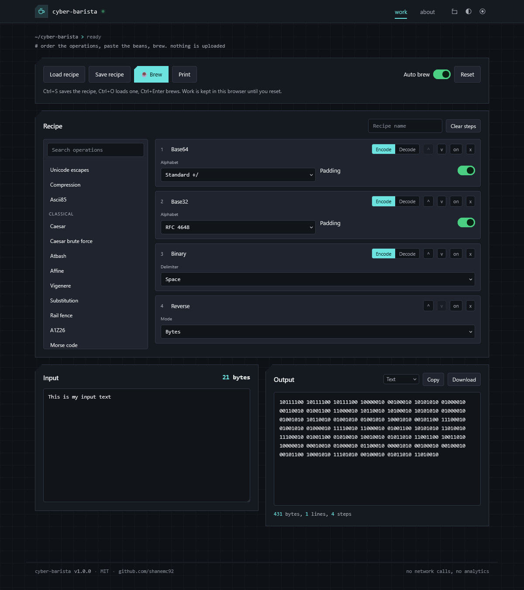

# cyber-barista &#9749;

A small, offline CyberChef. Order the operations, paste the beans, brew. One HTML file, no build step, no dependencies, no network calls. Open `index.html` and it works, including from `file://`.

Every step takes bytes and returns bytes, so binary output survives into the next step.

## Operations

| Group | Operations |
|---|---|
| Encoding | Base64, Base32, Base58, Ascii85, Hex, Binary, Decimal, URL, HTML entities, Unicode escapes, Compression (gzip, zlib, raw deflate) |
| Classical | Caesar, Caesar brute force, Atbash, Affine, Vigenere, Substitution, Rail fence, A1Z26, Morse code, Bacon cipher, Polybius square |
| Hashing | Hash (MD5, SHA-1, SHA-256, SHA-384, SHA-512, CRC-32), HMAC |
| Crypto | XOR, XOR brute force, RC4, ROT13 / ROT-N / ROT47 |
| Parsing | JWT decode with optional HS256 verification, JSON beautify or minify, Timestamp conversion, Defang and refang |
| Analysis | **What is this?**, Entropy report with byte distribution, Extract (IPv4, IPv6, domains, URLs, emails, hashes), Strings |
| Text | Find and replace with regex, Line tools, Change case, Reverse, Strip |

Dual operations show an encode / decode switch on the step. Single operations do not.

## What is this?

Paste a blob and it tells you what the blob is instead of converting it. It recognises JWTs (including whether they are expired), UUIDs v1 to v7 with the embedded timestamp and node MAC decoded, MAC addresses with the vendor block and the local and multicast bits, IPv4 and IPv6 with their reserved range, hex by length, epoch timestamps at every unit including Windows FILETIME, ISO 8601 dates, Windows SIDs with well known RIDs, PEM blocks, SSH public keys, `/etc/shadow` and bcrypt and Kerberos hash formats, API key and token prefixes, payment cards by Luhn and prefix, IBANs by their mod 97 check, Bitcoin and Ethereum addresses, file magic bytes for about fifty formats, and the usual text shapes: JSON, XML, cron, semver, morse, hexdump, percent encoding.

With **Decode and look inside** on, anything that is plainly Base64, Base32 or hex and not already identified gets decoded and checked again, so you get answers like "Base64 of a gzip stream that decompresses to JSON" or "Base64 of UTF-16LE text, which is what PowerShell `-EncodedCommand` uses". It stops speculating once something has matched outright.

It is all shape, prefixes, magic bytes, bit flags and check digits, plus a short built-in list of common MAC blocks. There is no lookup and nothing to go stale, and a miss on the vendor block means only that it was not in the short list.

## Using it

- Paste into the input pane. Output brews automatically, or turn Auto brew off and use the Brew button on large inputs.
- Steps can be reordered, disabled without removing them, and removed. A failing step stops the chain and shows the reason on the step.
- Output can be viewed as text or as a hexdump, copied, or downloaded.
- **Save recipe** writes the steps, their arguments and the current input to JSON. **Load recipe** reads it back.
- Ctrl+S saves, Ctrl+O loads, Ctrl+Enter brews.

## Notes

- Hashing uses the browser's WebCrypto, which needs `https`, `localhost` or `file://`. MD5 and CRC-32 are implemented in the file because WebCrypto does not offer them, and they still work anywhere.
- Compression uses the browser's own `CompressionStream` and `DecompressionStream`.
- MD5, CRC-32, RC4, ROT, XOR and everything under Classical are here for CTFs, analysis and legacy formats. None of them protect anything.
- The classical ciphers take an alphabet: `a-z` keeps case and leaves everything else alone, the wider ones (`A-Z a-z`, alphanumeric, ASCII printable) treat every character in them as part of the ring, and Custom takes your own. Affine rejects a multiplier that shares a factor with the alphabet length, since it would not be reversible.
- The recipe and the current input are kept in this browser's local storage so a reload does not lose work, and a saved recipe file contains any key or secret typed into a step. Reset clears both.
- Loaded recipes are treated as untrusted: unknown operations and argument keys are dropped and every value is coerced to the type its argument expects.
- Base64 and hex decoding are lenient, so whitespace and stray characters are dropped rather than rejected. Base58 is capped, since it is bignum maths and gets slow quickly.
- A pathological regex in Find / replace can hang the tab, the same as it would anywhere else. Reload if that happens, the recipe is restored from local storage.

## Appearance

Three independent controls in the top bar, each saved separately, so changing
one never resets the others.

**Design** sets the shape language, surface hue and backdrop texture:

| Design | Shape | Backdrop |
|---|---|---|
| `chamfer` | Cut corners | Instrument grid. The default |
| `console` | Square, graphite | Horizontal scan rules |
| `circuit` | Slight radius, board green | Via holes, copper edge |
| `contour` | Soft radii, violet | A single accent wash |

**Mode** sets the lightness ramp only, and every design supports every mode:

| Mode | Base |
|---|---|
| `dark` | Lights off. The default |
| `dusk` | Dark, lifted off black, for long sessions |
| `sepia` | Warm paper, bright but low glare |
| `light` | Cool white, closest to print |

**Accent** is any hue. Eight presets are offered, plus a hue/chroma wheel and a
hex field for matching a brand colour exactly.

That is sixteen design-and-mode combinations, on any accent.

Geometry is deliberately shared: every design uses the same bar height, panel
padding, control padding, type sizes and grid, so switching design changes
colour, radius and ornament without reflowing the page.

The accent's lightness is not taken from the picker. The mode proposes a
starting lightness, then the accent is walked away from the surface it sits on
until it clears a measured contrast ratio. HSL lightness is not perceptual, so
a fixed value would leave some hues washed out on white and others muddy on
black; measuring instead is what lets any hue, including a near-white or
near-black pick, stay readable. Status colours (`--ok`, `--warn`, `--bad`)
stay semantic and are kept clear of the accent range, so the accent never
reads as state.

Printing forces one light palette regardless of design and mode, drops the
backdrop texture and the bar controls, and keeps the bar as a masthead so the
logo and tool name land on the page.

## Deployment

`_headers` (Netlify, Cloudflare Pages) and `.htaccess` (Apache) carry the same
CSP and hardening headers. Neither is needed to run the file locally, including
from `file://`.

## Licence

MIT. See `LICENSE`.
